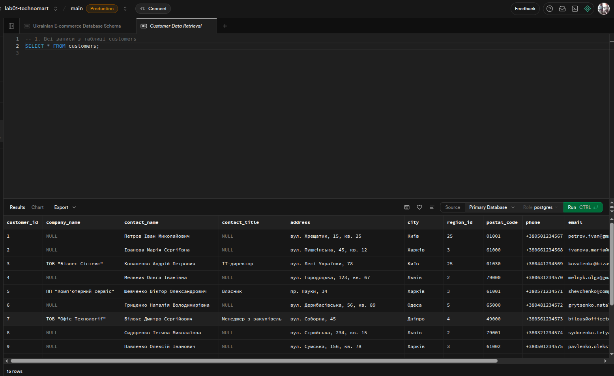
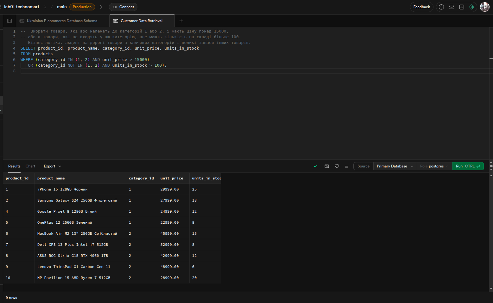

# Лабораторна робота 1. Робота з СУБД PostgreSQL та основи SQL

## Студентка: Ткачук Евеліна  
## Група: ІПЗ-32  

---

## Мета роботи

Ознайомлення з основами роботи із реляційними базами даних, встановлювання з'єднання з хмарною СУБД, дослідження структури бази даних та виконання базових SQL-запитів для отримання інформації.

---

## Налаштування середовища

- СУБД: PostgreSQL (Supabase)  
- База даних: technomart  
- Інструменти: Supabase SQL Editor  

---

# Рівень 1 - Основні SELECT запити

## 1.1 Основні SELECT запити

### 1.1.1 Отримати всі записи з таблиці customers  
Запит повертає всі стовпці та всі записи з таблиці customers.  

### 1.1.2 Вивести тільки назви товарів і їхні ціни з таблиці products  
Запит відбирає тільки два стовпці - назву товару та його ціну.  

### 1.1.3 Показати контактні дані всіх співробітників (ім'я, прізвище, телефон, email)  
Запит повертає основні контактні дані співробітників для швидкого доступу до інформації.  

## 1.2 Умови фільтрації

### 1.2.1 Знайти всіх клієнтів з міста Київ  
Фільтрація записів за конкретним містом для аналізу регіональної клієнтури.  

### 1.2.2 Вивести товари, які коштують більше 25000 грн  
Відбір дорогих товарів для аналізу преміум-сегменту.  

### 1.2.3 Показати всі замовлення зі статусом 'delivered'  
Перегляд успішно виконаних замовлень для аналізу ефективності доставки.  

### 1.2.4 Знайти співробітників, які працюють у відділі продажів  
Пошук співробітників за ключовим словом у посаді для формування команди продажів.  

## 1.3 Базове сортування ORDER BY

### 1.3.1 Відсортувати товари за зростанням ціни  
Упорядкування товарів для аналізу цінового діапазону від бюджетних до дорогих.  

### 1.3.2 Показати клієнтів в алфавітному порядку за іменем контактної особи  
Створення впорядкованого списку клієнтів для зручного пошуку.  

### 1.3.3 Вивести замовлення від найновіших до найстаріших  
Сортування замовлень для перегляду останньої активності клієнтів.  

## 1.4 Обмеження результатів LIMIT

### 1.4.1 Показати перші 10 найдорожчих товарів  
Відбір топових товарів за ціною для аналізу преміум-сегменту.  

### 1.4.2 Вивести 5 останніх замовлень (за датою)  
Перегляд найсвіжішої активності для оперативного моніторингу.  

### 1.4.3 Отримати перших 8 клієнтів в алфавітному порядку  
Вибірка першої групи клієнтів для демонстрації або тестування.  

---

# Рівень 2 - Розширені можливості SELECT

## 2.1 Пошук за зразком з LIKE

### 2.1.1 Знайти всіх клієнтів, чиї імена починаються на "Іван"  
Пошук клієнтів за початком імені для персоналізованої комунікації.  

### 2.1.2 Вивести товари, в назві яких є слово "phone" або "телефон"  

### 2.1.3 Власні запити з LIKE
- Пошук товарів, що починаються з "Samsung"  
- Пошук клієнтів з email на Gmail  
- Співробітники з прізвищем, що закінчується на "енко"  

## 2.2 Логічні оператори AND, OR, NOT

### 2.2.1 Знайти товари дорожчі за 15000 грн і дешевші за 50000 грн  
Відбір товарів середнього цінового сегменту для аналізу основної аудиторії.  

### 2.2.2 Вивести клієнтів з Києва або Львова, які є юридичними особами  
Аналіз B2B сегменту в найбільших містах для корпоративних продажів.  

### 2.2.3 Власні запити з логічними операторами  
- Активні товари з хорошими залишками  
- Замовлення високої вартості або терміново виконані  
- Співробітники не з керівних посад з телефонами  
- Клієнти-фізичні особи з великих міст або всі з Західної України  

## 2.3 Оператори IN, BETWEEN, IS NULL

### 2.3.1 Вивести клієнтів з міст Київ, Харків, Одеса, Дніпро  
Аналіз клієнтської бази в мільйонних містах для стратегічного планування.  

### 2.3.2 Знайти товари в ціновому діапазоні від 10000 до 30000 грн  
Відбір товарів доступного сегменту для масових продажів.  

### 2.3.3 Власні запити з IN, BETWEEN, IS NULL  

## 2.4 Складні комбінування умов

### 2.4.1 Комплексний аналіз товарного асортименту  
Відбір товарів оптимальних для проведення акцій з достатніми залишками.  

### 2.4.2  

### 2.4.3  

### 2.4.4  
  

### 2.4.5  
 

## 2.5 Складне сортування та пагінація

### 2.5.1 Багаторівневе сортування товарів  
Структурований перегляд асортименту з пріоритетом популярних товарів.  

### 2.5.2 Сортування клієнтів за пріоритетом  
Розстановка клієнтів за пріоритетом: корпоративні з Києва спочатку.  

### 2.5.3  
 

### 2.5.4  

### 2.5.5  
 

---

# Рівень 3 - Експертні запити

## 3.1 Складні комбінації LIKE з логічними операторами  
 

## 3.2 Вкладені логічні умови

### 3.2.1 Знайти товари дорожчі 20000 грн (категорії 1 або 2) АБО товари дешевші 5000 грн будь-якої категорії  

### 3.2.2 Комплексна сегментація клієнтів  
Виділення ключових сегментів: корпорації з великих міст, заможні приватні клієнти Києва, компанії з Заходу та Півдня.  

### 3.2.3  

## 3.3 Комплексні аналітичні запити

### 3.3.1 Звіт товарів з множинними критеріями  
Всебічний аналіз активного асортименту з сегментацією за ціною та залишками.  

### 3.3.2 Аналіз клієнтської бази з множинними критеріями  
Створення детальної сегментації клієнтів для персоналізованого підходу.  

## 3.4 Дослідження даних та пошук закономірностей

### 3.4.1 Аналіз товарів за ціновими сегментами

#### Запит 1: Розподіл товарів по ціновим категоріям  
Бізнес-логіка: Визначення структури товарного портфеля для планування асортименту.  

#### Запит 2: Товари з найвищою маржинальністю за сегментами  
Бізнес-логіка: Фокус на найбільш прибуткові позиції.  

#### Запит 3: Аналіз цінових розривів  
Бізнес-логіка: Виявлення цінових ніш без товарів для планування закупівель.  

### 3.4.2 Дослідження розподілу клієнтів за географією

#### Запит 1: Концентрація клієнтів по містах  
Аналіз географічної структури клієнтів для оптимізації логістики.  

#### Запит 2: Потенціал розвитку по регіонах  
Визначення міст з найбільшим потенціалом для розширення.  

#### Запит 3: Якість клієнтської бази по регіонах  
Оцінка якості даних для планування CRM-активностей.  

#### Запит 4: Регіональна сегментація для логістики  
Створення зон для оптимізації доставки.  

### 3.4.3 Аналіз часових патернів в замовленнях

#### Запит 1: Кількість замовлень за роками  

#### Запит 2: Кількість замовлень по місяцях 2024 року  

#### Запит 3: Середній час доставки по роках  

## 3.5 Креативні завдання

### Запит 1: Постачальник з найбільшим середнім запасом і кількістю категорій  

### Запит 2: Топ-5 клієнтів з найбільшою кількістю замовлень у січні 2024  

### Запит 3: Середній відсоток знижки по категоріях з ваговою оцінкою  

### Запит 4: Зміни кількості замовлень по тижнях з порівнянням кварталів  

### Запит 5: Продукти з нестабільним попитом (коефіцієнт варіації > 1.5)  

---

...

---

